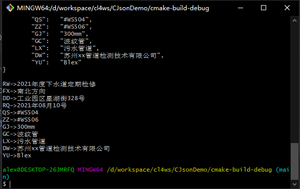

# [C语言中使用json](https://juejin.cn/post/6995042402276737060/)

> 为建立中文知识库加块砖　　　　　　　　——中科大胡不归

## 问题描述

你已经是个成熟的语言了，你需要能处理json数据了。

## 解决办法

### CJson

使用现成的轮子[CJson](https://github.com/DaveGamble/cJSON)库处理json数据。

#### 从字串中解析出JSON结构

```
/* Supply a block of JSON, and this returns a cJSON object you can interrogate. Call cJSON_Delete when finished. */
cJSON *cJSON_Parse(const char *value);//从 给定的json字符串中得到cjson对象
```

#### 增

```
/* Append item to the specified array/object. */
CJSON_PUBLIC(cJSON_bool) cJSON_AddItemToArray(cJSON *array, cJSON *item);

CJSON_PUBLIC(cJSON*)cJSON_AddNumberToObject(cJSON *const object, const char *const name, const double number);

CJSON_PUBLIC(cJSON*)cJSON_AddStringToObject(cJSON *const object, const char *const name, const char *const string);
```

为数组类型增加子项：

```
/* Append item to the specified array/object. */
CJSON_PUBLIC(cJSON_bool) cJSON_AddItemToArray(cJSON *array, cJSON *item);
```

#### 删

```
/* Delete a cJSON entity and all subentities. */
void   cJSON_Delete(cJSON *c);//删除cjson对象，释放链表占用的内存空间
```

#### 改

```
CJSON_PUBLIC(cJSON_bool) cJSON_ReplaceItemInObject(cJSON *object, const char *string, cJSON *newitem);
```

#### 查

```
/* Get item "string" from object. Case insensitive. */
cJSON *cJSON_GetObjectItem(cJSON *object,const char *string);//根据键获取对应的值（cjson对象）
```

### 代码示例

[源码](https://github.com/zhongwcool/CJsonDemo)

```c
#include <stdio.h>
#include <stdlib.h>
#include <string.h>
#include "cJSON.h"

void print_json(cJSON *root) {
    //以递归的方式打印json的最内层键值对
    //Recursively print the innermost key-value pair of json
    printf("\n");

    for (int i = 0; i < cJSON_GetArraySize(root); i++) {
        //遍历最外层json键值对
        cJSON *item = cJSON_GetArrayItem(root, i);
        if (cJSON_Object == item->type) {
            //如果对应键的值仍为cJSON_Object就递归调用printJson
            print_json(item);
        } else {
            //值不为json对象就直接打印出键和值
            printf("%s->%s\n", item->string, item->valuestring);
        }
    }
}

char *json_load(char *filepath) {
    FILE *fp;
    long len;
    char *content;

    fp = fopen(filepath, "rb");
    fseek(fp, 0, SEEK_END);
    len = ftell(fp);
    fseek(fp, 0, SEEK_SET);
    content = (char *) malloc(len + 1);
    fread(content, 1, len, fp);

    fclose(fp);

    return content;
}

void print_json_file(char *filepath) {
    //从文件中读取内容到缓冲区
    char *json_str = json_load(filepath);
    //printf("%s\n", json_str);

    //从缓冲区中解析出JSON结构
    cJSON *json = cJSON_Parse(json_str);

    print_json(json);

    //delete cjson
    cJSON_Delete(json);
}

void create_demo_json_file(char *filepath) {
    char *raw = "{"RW":"2021年度下水道定期检修","FX":"南北方向","DD":"工业园区星湖街328号","RQ":""
                "2021年08月10号","QS":"#WS504","ZZ":"#WS506","GJ":"300mm","GC":"波纹管","LX":""
                "污水管道","DW":"苏州xx管道检测技术有限公司","YU":"Alex"}";

    //从json字串中解析出JSON结构
    cJSON *json = cJSON_Parse(raw);

    //将传入的JSON结构转化为字符串 并打印
    char *buf = cJSON_Print(json);
    printf("raw json:\n%s\n", buf);

    //修改某项的节点值
    cJSON_ReplaceItemInObject(json, "YU", cJSON_CreateString("Blex"));
    buf = cJSON_Print(json);
    printf("modified json:\n%s\n", buf);

    //打开一个文件，并写入json内容
    FILE *fp = fopen(filepath, "w");
    fwrite(buf, strlen(buf), 1, fp);

    fclose(fp);
    free(buf);
    cJSON_Delete(json);
}

int main() {
    printf("Hello, World!\n");

    //创建一个包含json数据的文件
    create_demo_json_file("jiance.json");
    //读取这个文件，并打印
    print_json_file("jiance.json");

    return 0;
}
```

### 运行效果



## 参考文章

1. [cJSON 使用详解](https://www.cnblogs.com/catgatp/p/6379955.html)
2. [全面详解c语言使用cJSON解析JSON字符](https://blog.csdn.net/bjbz_cxy/article/details/79173603)
3. [# cjson读取json文件_json文件解析](https://blog.csdn.net/weixin_39882623/article/details/113010355)
4. [C语言处理json字符串](https://www.cnblogs.com/jkred369/p/7392364.html)
5. [修改json对象的值并进行保存](https://blog.csdn.net/linbaokun/article/details/88405265)

# Reference

Welcome to [CJson](https://github.com/DaveGamble/cJSON).
